# Faro AI · App mobile (Sprint 3 — Mobile Development and IoT)

App Android/iOS da plataforma **Faro AI** para o **Ford × FIAP Challenge 2026**. Ele leva ao consultor da concessionária os dois desafios da Ford:

- **Desafio 2 — Retenção (VIN Share):** carteira de clientes, perfil de retenção previsto pelo modelo (fiel, abandono, esquecido, econômico), risco de evasão, leads priorizados, análise por IA e ações sugeridas.
- **Desafio 1 — Inteligência competitiva:** catálogo de picapes, comparação lado a lado de 2 a 5 veículos com placar e ficha técnica.

<p>
  
</p>

| | |
|---|---|
| **Versão** | 1.0.0 (`versionCode` 1) |
| **Pacote Android** | `com.faroai.fordretencao` |
| **Stack** | Expo SDK 52 · React Native 0.76 · Expo Router 4 · TypeScript estrito |
| **APK** | gerado com Expo EAS Build (perfil `preview`) — veja [Gerar o APK](#-gerar-o-apk) |
| **Login de demonstração** | `admin@faroai.com.br` · `Ford2026!` (ou o botão **Entrar com conta demonstração**) |

---

## 📱 Telas

### Capturas da atividade Mobile Development and IoT

O painel abaixo reúne as capturas da entrega. Abra [contact.png](../../docs/mobile/screenshots/atividade-mobile/contact.png) em tamanho original para ampliar os detalhes. Os arquivos individuais estão em [`docs/mobile/screenshots/atividade-mobile/`](../../docs/mobile/screenshots/atividade-mobile/).

<p>
  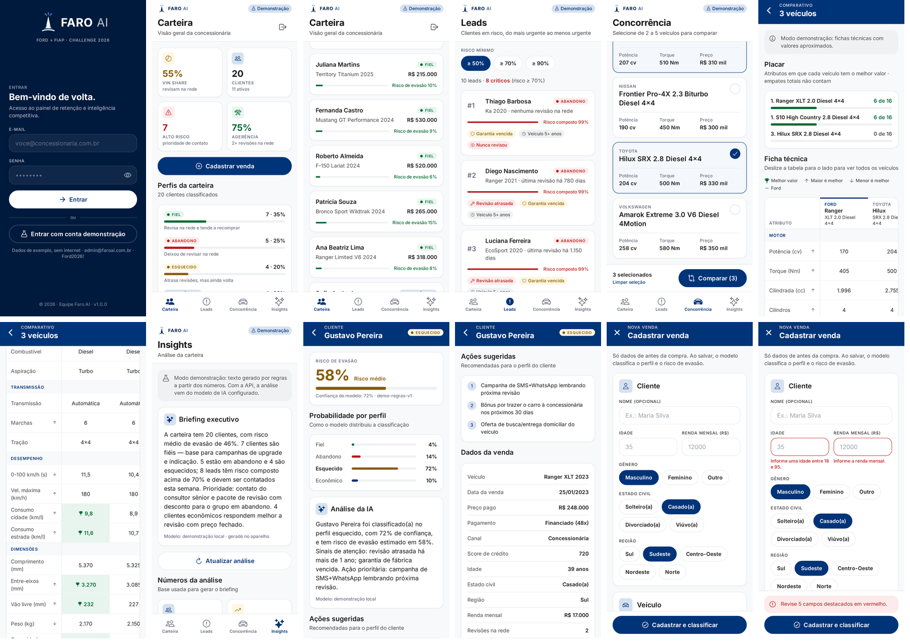
</p>

### Galeria de telas

| Login | Carteira | Carteira · clientes |
|---|---|---|
|  | 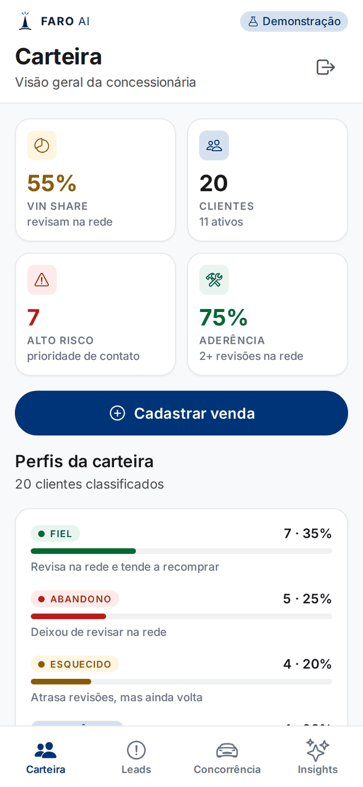 | 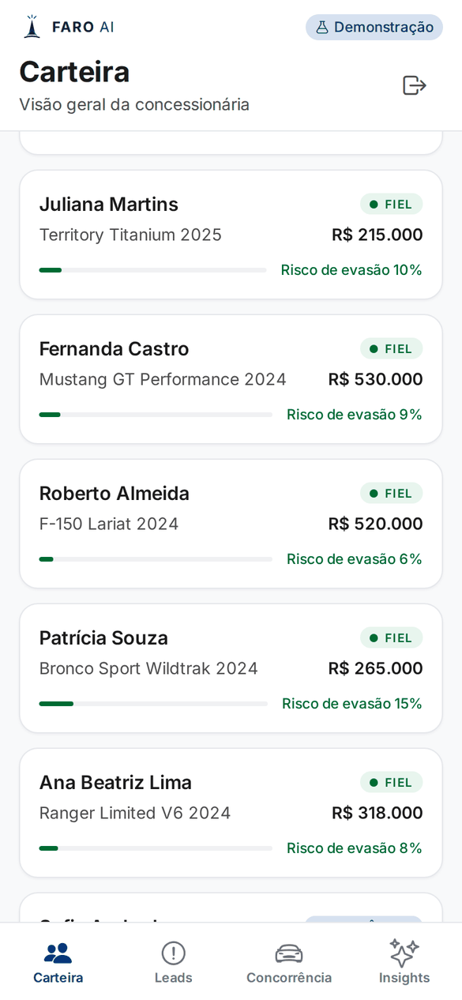 |
| Logo Faro AI, validação por campo, erro na própria tela e acesso de demonstração com um toque. | KPIs (VIN Share, clientes, alto risco, aderência), cadastro de venda e perfis da carteira. | Clientes recentes com modelo, preço, perfil e risco de evasão. |

| Leads | Concorrência | Comparar · placar |
|---|---|---|
| 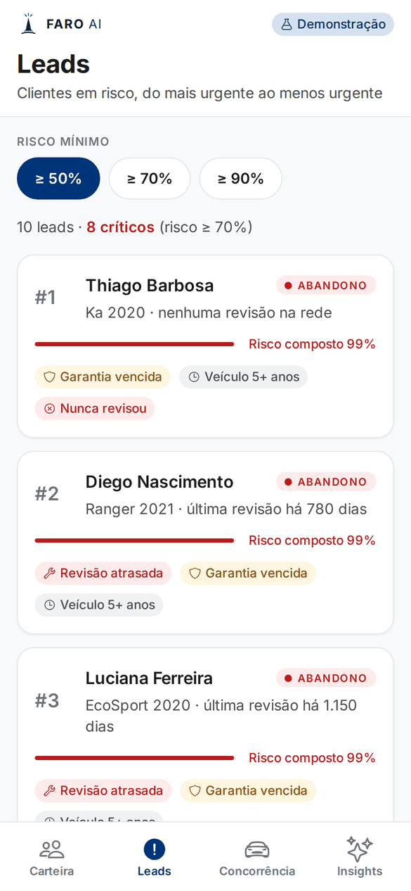 | 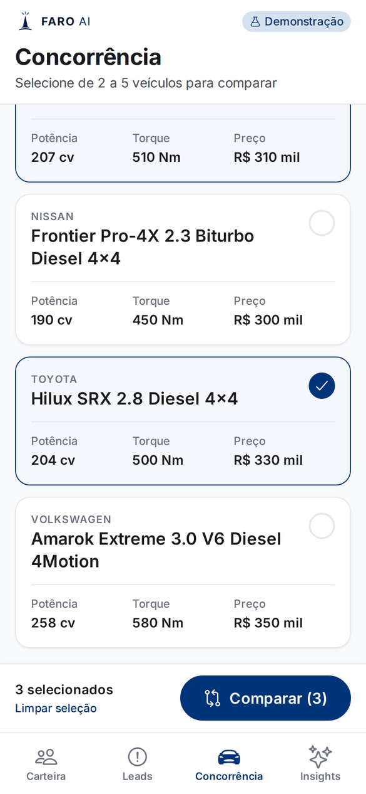 | 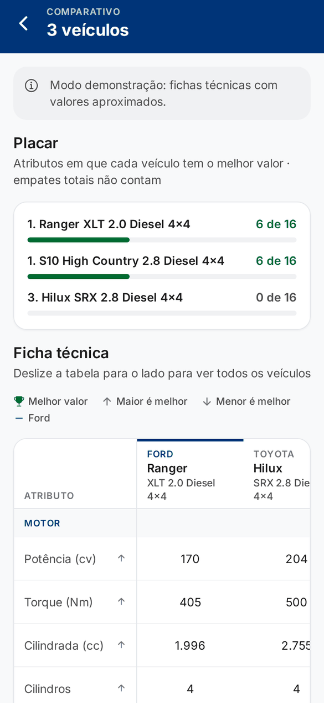 |
| Ranking por risco composto, filtro de risco mínimo e sinais (revisão atrasada, garantia…). | Busca, filtro Ford/Concorrentes, seleção de 2 a 5 veículos e botão fixo "Comparar". | Quantos atributos cada veículo vence — empates totais não contam. |

| Comparar · ficha técnica | Insights | Detalhe do cliente |
|---|---|---|
| 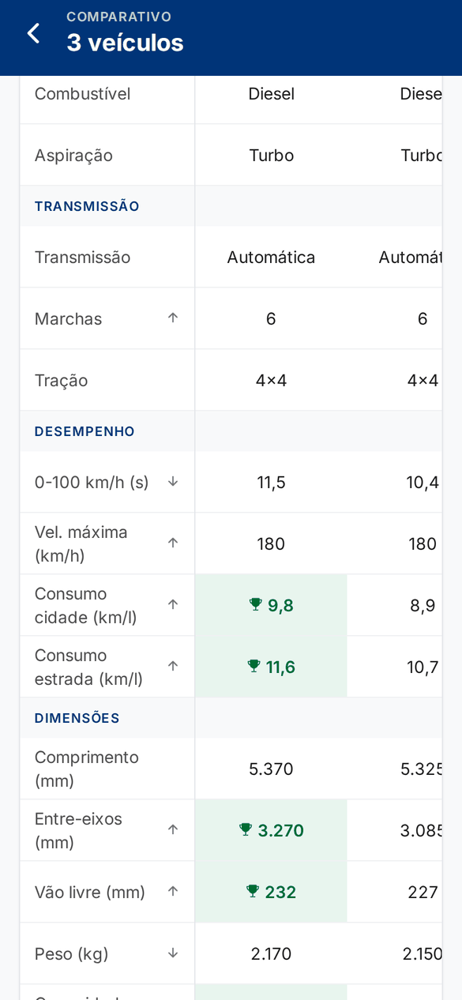 |  | 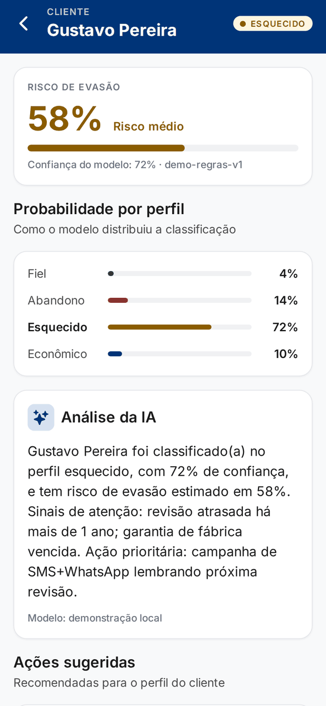 |
| Coluna de atributos fixa, rolagem horizontal e melhor valor em verde. | Briefing executivo da carteira e números usados na análise. | Risco de evasão, probabilidade por perfil e análise da IA sob demanda. |

| Cliente · ações e dados | Cadastrar venda | Cadastro · validação |
|---|---|---|
| 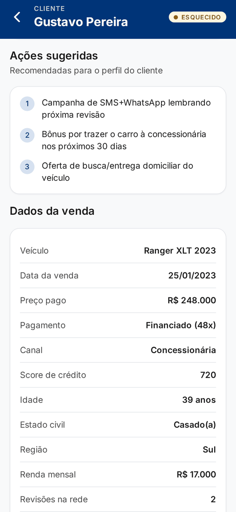 | 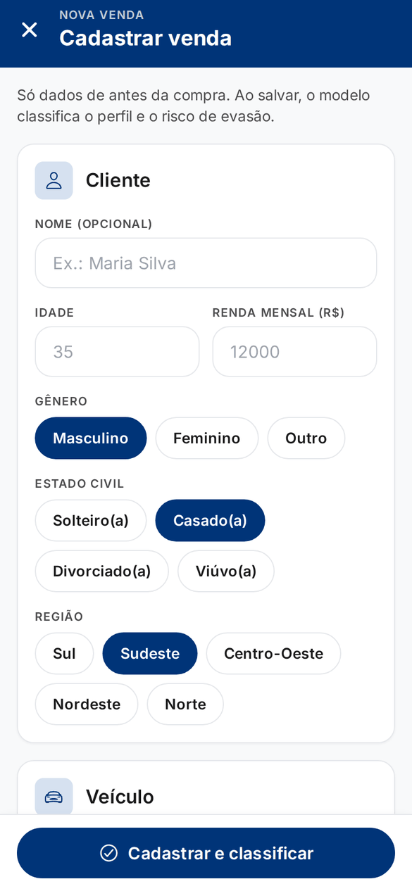 | 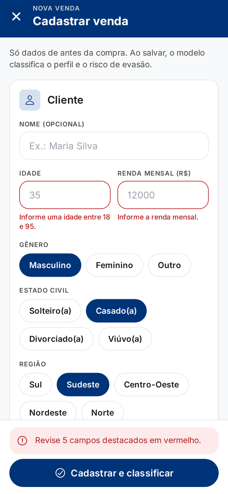 |
| Ações recomendadas para o perfil e dados da venda em português. | Dados de pré-compra; ao salvar, o cliente é classificado na hora. | Mesmos limites da API, erro por campo e aviso no rodapé. |

> Prints em tamanho de celular (390 × 844 pt), gerados a partir do mesmo código no modo demonstração.

---

## ✅ Fluxos

| # | Fluxo | Caminho |
|---|---|---|
| 1 | Entrar / sair (com confirmação) | Login → Carteira → ícone de sair |
| 2 | Acompanhar a carteira | Carteira → KPIs, perfis, clientes recentes → detalhe |
| 3 | Priorizar contatos | Leads → filtro de risco → lead → detalhe e ações sugeridas |
| 4 | Entender um cliente | Detalhe → risco, probabilidades → **Explicar este cliente** (IA) |
| 5 | Cadastrar uma venda | Carteira → **Cadastrar venda** → formulário → cliente classificado → Carteira e Leads atualizados |
| 6 | Comparar concorrentes | Concorrência → selecionar 2–5 → **Comparar** → placar e ficha técnica |
| 7 | Ler a análise da carteira | Insights → briefing → **Atualizar análise** |

Toda tela trata **carregando**, **erro com "Tentar novamente"**, **lista vazia** e **puxar para atualizar**. Ao voltar para uma aba, os dados são recarregados em silêncio.

---

## 🧱 Arquitetura

As telas nunca chamam a rede diretamente: dependem de uma interface (`DataSource`) com duas implementações, escolhidas pela variável `EXPO_PUBLIC_DATA_MODE` — o mesmo padrão *Repository* de Java/Spring.

```
app/ (telas · Expo Router)
  │  useAsync / useAuth
  ▼
lib/data/DataSource.ts ── interface + DataSourceError (mensagens em português)
  ├── ApiDataSource.ts     → API REST (apps/api): JWT de POST /auth/login, timeout, Problem Details, 401 → login
  └── LocalDataSource.ts   → modo demonstração, 100% offline (usado no APK)
        ├── mock/clients.ts, mock/vehicles.ts   dados fictícios
        ├── LocalRiskClassifier.ts              classificação por regras (substitui o XGBoost)
        └── LocalVehicleComparator.ts           mesma lógica de comparação da API
```

| Modo | `EXPO_PUBLIC_DATA_MODE` | Onde é usado | Dados |
|---|---|---|---|
| **Demonstração** | `local` | APK de entrega (`eas.json` → `preview`/`production`) | 20 clientes e 8 picapes fictícios; cadastros ficam salvos no aparelho (AsyncStorage) |
| **API** | `api` (padrão) | Desenvolvimento | `apps/api` + Supabase + serviço de ML; URL em `EXPO_PUBLIC_API_URL` |

No modo demonstração o app deixa claro que os dados são de exemplo (etiqueta **Demonstração** no topo e avisos em Comparar e Insights).

### Estrutura de pastas

```
apps/mobile/
├── app/                          # rotas (Expo Router)
│   ├── _layout.tsx               # fontes, AuthProvider e redirecionamento por sessão
│   ├── (auth)/login.tsx
│   ├── (tabs)/                   # Carteira · Leads · Concorrência · Insights
│   ├── client/[id].tsx           # detalhe do cliente
│   ├── client/new.tsx            # cadastrar venda
│   └── compare.tsx               # comparação de veículos
├── components/
│   ├── ui/                       # design system (Button, Card, TextField, Screen, AppHeader…)
│   ├── ClientCard.tsx · VehicleCard.tsx · ComparisonTable.tsx
├── lib/
│   ├── data/                     # camada de dados (acima)
│   ├── auth/AuthProvider.tsx     # sessão + useAuth()
│   ├── hooks/                    # useAsync, useRevalidateOnFocus
│   ├── theme.ts                  # tokens de design (base: packages/ui, compartilhado com a web)
│   ├── format.ts · domain.ts · clientForm.ts · types.ts · config.ts
├── assets/                       # ícone, ícone adaptativo, splash (scripts/generate-mobile-assets.py)
├── app.json · eas.json
```

---

## 🎨 Identidade visual

- **Mesmos tokens da web** (`packages/ui` + `lib/theme.ts`): azul Ford `#003478`, azul-escuro `#001A3D`, superfícies e bordas iguais às do painel web.
- **Tipografia Inter** (a mesma da web) embutida no app, com hierarquia única (`textStyles`: título, corpo, legenda…).
- **Componentes únicos** em `components/ui` — todas as telas usam os mesmos cards, botões, campos, cabeçalhos e estados de carregamento/erro/vazio.
- **Cores com significado:** risco baixo/médio/alto em verde/âmbar/vermelho; cada perfil tem sua cor em todo o app.
- **Acessibilidade:** contraste WCAG AA (≥ 4,5:1) em todos os textos coloridos, áreas de toque de 48 pt, rótulos para leitor de tela (`aria-*`) e fonte limitada a 1,3× para não quebrar layouts.
- **Ícone e splash** com o farol da marca Faro AI.

---

## ▶️ Rodar em desenvolvimento

Pré-requisitos: Node ≥ 20, pnpm ≥ 9 e o app **Expo Go** (ou um emulador Android).

```bash
# na raiz do monorepo
pnpm install
pnpm dev:mobile            # abre o Expo; leia o QR code com o Expo Go
```

Para escolher o modo, crie `apps/mobile/.env.local`:

```bash
# modo demonstração (sem API)
EXPO_PUBLIC_DATA_MODE=local

# ou modo API (use o IP do computador, não "localhost", para testar no celular)
EXPO_PUBLIC_DATA_MODE=api
EXPO_PUBLIC_API_URL=http://192.168.0.10:3333
```

> Ao trocar de modo, reinicie limpando o cache: `npx expo start --clear` (o Metro guarda as variáveis `EXPO_PUBLIC_*`).

Verificação de tipos: `pnpm --filter @ford/mobile typecheck`.

---

## 📦 Gerar o APK

O build roda na nuvem da Expo (EAS Build) e gera um `.apk` instalável em celular ou emulador.

```bash
cd apps/mobile
npx eas-cli@latest login                                  # conta expo.dev
npx eas-cli@latest init                                   # só na primeira vez (grava o projectId)
npx eas-cli@latest build --platform android --profile preview
```

- Na primeira vez, responda **Yes** para gerar a keystore Android (o EAS guarda a chave).
- Ao terminar, o EAS mostra o link e o QR code para baixar o APK.
- Perfis em `eas.json`: `preview` e `production` geram APK no modo demonstração; `development` gera APK apontando para a API.

**Instalar:** no celular, abra o link e permita "instalar apps desconhecidos"; no emulador, arraste o `.apk` para a janela ou use `adb install faro-ai.apk`.

---

## 🧪 Qualidade

- TypeScript estrito sem erros (`tsc --noEmit`).
- Instalação com lockfile travado (`pnpm install --frozen-lockfile`) e bundle Android (Hermes) gerados sem erros.
- Fluxos 1 a 7 verificados de ponta a ponta nos dois modos (no modo API, contra uma API com o mesmo contrato: login JWT, 401 com volta ao login, erro de conexão).
