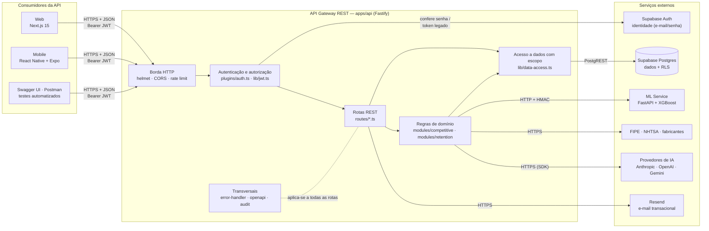
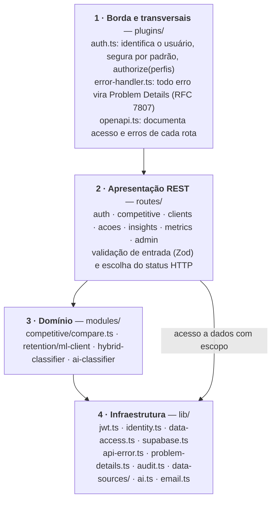
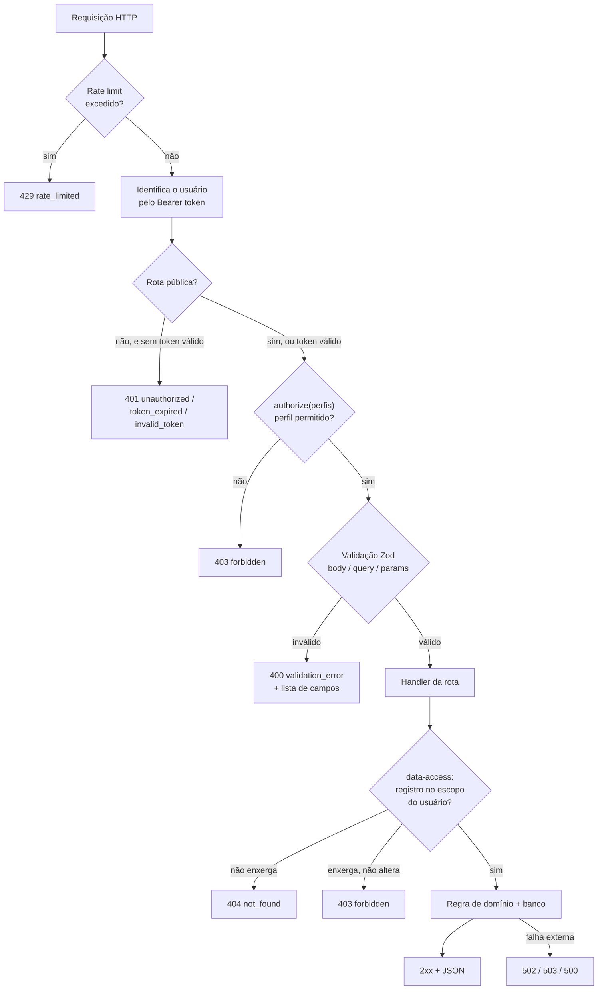
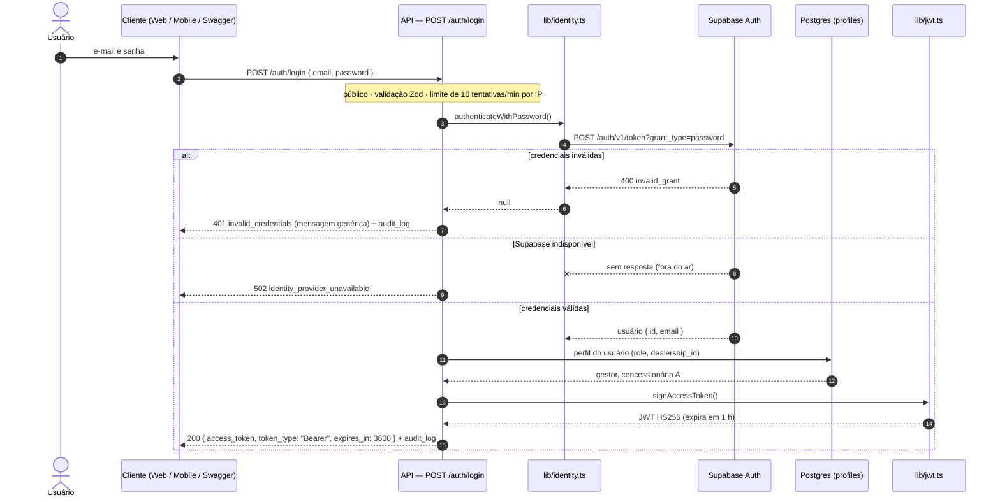
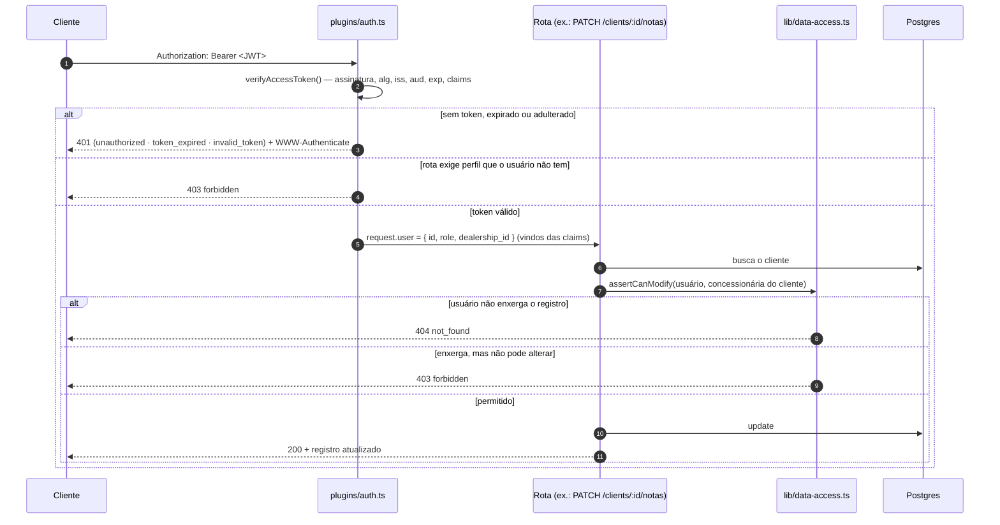

# Arquitetura da Solução — Faro AI

> **Sprint 3 · Arquitetura Orientada a Serviços e Web Services**
> Ford × FIAP Challenge 2026 — API REST `apps/api` (Node.js + Fastify + TypeScript)

Este documento descreve os componentes da solução, como as responsabilidades estão separadas
e como os serviços se comunicam e autenticam. Os diagramas estão em Mermaid (o GitHub os desenha
automaticamente); versões em imagem ficam em [`docs/arquitetura/`](arquitetura/).

## Onde cada critério da Sprint 3 é atendido

| Critério | Onde está |
|---|---|
| Arquitetura — componentes e responsabilidades | [§1 Diagrama de componentes](#1-componentes-e-responsabilidades) |
| Arquitetura — separação de responsabilidades | [§2 Organização em camadas](#2-organização-e-separação-de-responsabilidades) |
| Arquitetura — fluxo de comunicação e autenticação | [§3 Comunicação](#3-fluxo-de-comunicação) · [§4 Autenticação](#4-fluxo-de-autenticação-e-autorização) |
| Autenticação e autorização (público × protegido, perfis) | [§4.4 Matriz de perfis](#44-perfis-e-controle-de-acesso) · `apps/api/src/plugins/auth.ts` · `apps/api/src/lib/data-access.ts` |
| JWT (geração, validação, expiração, claims) | [§4.3 O token JWT](#43-o-token-jwt) · `apps/api/src/lib/jwt.ts` · `POST /auth/login` |
| REST nível 2 (recursos, verbos, status codes) | [§5 API REST](#5-api-rest--maturidade-nível-2) |
| Documentação e erros padronizados | Swagger em `/docs` · [§6 Erros](#6-tratamento-de-erros) · `apps/api/src/plugins/error-handler.ts` |
| Testes automatizados | [§7 Testes](#7-testes-automatizados) · `apps/api/test/` |

---

## 1. Componentes e responsabilidades



| Componente | Onde fica | Responsabilidade | O que **não** faz |
|---|---|---|---|
| **Web / Mobile** | `apps/web`, `apps/mobile` | Interface do analista, gestor e admin | Não acessa o banco diretamente para regras de negócio — consome a API |
| **Borda HTTP** | `app.ts` (helmet, CORS, rate limit) | Cabeçalhos de segurança, origens permitidas, limite de requisições por IP/usuário | Não conhece usuários nem regras |
| **Autenticação e autorização** | `plugins/auth.ts`, `lib/jwt.ts`, `lib/identity.ts` | Identifica o usuário pelo token, exige token em toda rota não pública, restringe por perfil | Não consulta dados de negócio |
| **Rotas REST** | `routes/*.ts` | Expor recursos (`/clients`, `/acoes`, `/competitive/vehicles`…), validar entrada (Zod), escolher o status HTTP | Não decide **quem** pode ver o quê (delegado a `data-access`) |
| **Regras de domínio** | `modules/competitive`, `modules/retention` | Comparação de veículos, classificação de clientes (ML + IA) | Não conhece HTTP |
| **Acesso a dados com escopo** | `lib/data-access.ts` | Aplicar a regra de visibilidade por concessionária (leitura × alteração) | Não valida token |
| **Transversais** | `plugins/error-handler.ts`, `plugins/openapi.ts`, `lib/audit.ts` | Formato único de erro, documentação OpenAPI, trilha de auditoria | — |
| **Supabase Auth** | serviço gerenciado | Guardar credenciais e conferir e-mail/senha | Não emite o token usado pela API (quem emite é a própria API) |
| **Supabase Postgres** | serviço gerenciado + `supabase/migrations` | Persistência; RLS como **segunda** camada de defesa | — |
| **ML Service** | `services/ml` (FastAPI) | Predição de perfil de cliente (XGBoost) | Não recebe dados pessoais (nome, CPF, e-mail) |
| **FIPE / NHTSA / IA / Resend** | serviços externos | Preço de referência, especificações, enriquecimento por IA, envio de e-mail | — |

---

## 2. Organização e separação de responsabilidades

### 2.1 Camadas da API



```
apps/api/src/
├── app.ts                  # monta a aplicação (plugins + rotas) — sem abrir porta
├── server.ts               # ponto de entrada: buildApp() + listen()
├── config.ts               # variáveis de ambiente validadas com Zod
├── plugins/                # comportamento aplicado a TODAS as rotas
│   ├── auth.ts             #   autenticação segura por padrão + authorize(...perfis)
│   ├── error-handler.ts    #   formato único de erro (Problem Details)
│   └── openapi.ts          #   documentação automática de acesso e erros
├── routes/                 # recursos REST — um arquivo por recurso
│   ├── auth.ts             #   POST /auth/login (emite o JWT)
│   ├── vehicles.ts         #   catálogo competitivo: consulta e comparação
│   ├── admin-vehicles.ts   #   catálogo competitivo: cadastro, edição, importação
│   ├── clients.ts          #   clientes / VIN share
│   ├── acoes.ts            #   ações de retenção e campanhas
│   ├── insights.ts         #   explicações por IA
│   ├── metrics.ts · ford-real.ts
│   └── ai-config.ts        #   chaves de IA (admin) e preferências do usuário
├── modules/                # regras de domínio, independentes de HTTP
└── lib/                    # infraestrutura e utilitários
    ├── jwt.ts              #   gerar e validar o JWT da API
    ├── identity.ts         #   adaptador do Supabase Auth
    ├── data-access.ts      #   escopo de concessionária (leitura × alteração)
    ├── api-error.ts        #   erros HTTP tipados (notFound, forbidden…)
    └── problem-details.ts  #   schema do erro padrão
```

### 2.2 Caminho de uma requisição

Cada etapa tem **uma** responsabilidade e devolve seu próprio status de erro:



Observações:
- A autenticação roda em `onRequest`, **antes** da leitura do corpo: sem credencial, o servidor nem processa o payload.
- Todos os erros passam pelo `error-handler`, então a resposta tem sempre o mesmo formato (§6).

### 2.3 Princípios aplicados

| Princípio | Como aparece no código |
|---|---|
| **Segura por padrão** | Toda rota exige token; só `/health` e `/auth/login` são marcadas com `config: { public: true }`. Uma rota nova já nasce protegida — há um teste que percorre todas as rotas e garante isso. |
| **Menor privilégio** | Usuário sem perfil cadastrado recebe `analista`; analista sem concessionária recebe `403 no_dealership`. |
| **Defesa em profundidade** | A API aplica o escopo de concessionária **e** o Postgres mantém as políticas RLS. |
| **Não revelar existência** | Registro de outra concessionária responde `404`, não `403`. |
| **Responsabilidade única** | Emissão do token (`jwt.ts`) ≠ verificação de senha (`identity.ts`) ≠ escopo de dados (`data-access.ts`). |
| **Testabilidade** | `buildApp()` monta a API sem abrir porta; dependências externas são substituídas por dublês nos testes. |

---

## 3. Fluxo de comunicação

| Origem → destino | Protocolo | Autenticação | Formato | Observações |
|---|---|---|---|---|
| Web / Mobile / Swagger → **API** | HTTPS · REST | `Authorization: Bearer <JWT>` | JSON; erros em `application/problem+json` | CORS restrito a `ALLOWED_ORIGINS`; rate limit por usuário/IP |
| API → **Supabase Auth** | HTTPS | chave `apikey` do projeto | JSON | Só no login (`grant_type=password`) e para validar tokens legados |
| API → **Supabase Postgres** | HTTPS (PostgREST) | chave de serviço — ou o token legado do usuário (RLS) | JSON | Com token da API, o escopo é aplicado pela própria API |
| API → **ML Service** | HTTP interno | `Bearer` com segredo compartilhado + assinatura HMAC-SHA256 do corpo (`X-Payload-Signature`) | JSON | `dealership_id` pseudonimizado; nenhum dado pessoal sai da API |
| API → **FIPE / NHTSA / fabricantes** | HTTPS | token da FIPE (quando configurado) | JSON / HTML | Falha vira `502 fipe_unavailable` — detalhes só no log |
| API → **Provedores de IA** | HTTPS (SDK) | chave de API do provedor | JSON | Chaves ficam no servidor; o cliente só escolhe o modelo |
| API → **Resend** | HTTPS | `Bearer` com chave Resend | JSON | Sem chave configurada, o envio fica em modo simulação |

---

## 4. Fluxo de autenticação e autorização

### 4.1 Login — emissão do JWT



### 4.2 Requisição a um recurso protegido



**Tokens legados:** o web e o mobile ainda fazem login direto no Supabase. O plugin reconhece esses tokens
pelo emissor (`iss`) e os valida no Supabase Auth (`GET /auth/v1/user`), buscando o perfil no banco.
A partir daí o fluxo de autorização é **o mesmo** — a diferença é que o banco também aplica o RLS.

### 4.3 O token JWT

| Item | Valor |
|---|---|
| Emissor | a própria API (`POST /auth/login`) — `lib/jwt.ts` |
| Algoritmo | HS256 (HMAC-SHA256), segredo em `JWT_SECRET` (mínimo 32 caracteres) |
| Validade | `JWT_EXPIRES_IN_SECONDS` — padrão 3600 s (1 hora); devolvida em `expires_in` |
| Claims registradas | `sub` (id do usuário), `iss`, `aud`, `iat`, `exp`, `jti` (id único do token) |
| Claims da aplicação | `email`, `role` (`analista` · `gestor` · `admin`), `dealership_id` |
| Validação | assinatura · algoritmo fixo (bloqueia `alg: none`) · emissor · audiência · expiração · formato das claims (Zod) |
| Uso das claims | `role` decide o acesso por perfil e `dealership_id` decide o escopo de dados — **sem consultar o banco a cada requisição** |
| Proteção do segredo | em produção a API **não sobe** se `JWT_SECRET` não for definido |

Exemplo de payload:

```json
{
  "sub": "5f1c…",
  "email": "gestor@faroai.com.br",
  "role": "gestor",
  "dealership_id": "aaaaaaaa-aaaa-4aaa-8aaa-aaaaaaaaaaaa",
  "iss": "faro-ai-api",
  "aud": "faro-ai-clients",
  "iat": 1790552400,
  "exp": 1790556000,
  "jti": "0b6f…"
}
```

### 4.4 Perfis e controle de acesso

**Endpoints públicos:** `GET /health`, `POST /auth/login` e a documentação (`/docs`). **Todo o resto exige token.**

| Perfil | Leitura | Alteração | Exclusivo do perfil |
|---|---|---|---|
| `analista` | só a própria concessionária | só a própria concessionária | — |
| `gestor` | rede inteira | só a própria concessionária | cadastro/edição/exclusão/importação de veículos · catálogo canônico · campanhas |
| `admin` | rede inteira | rede inteira | tudo do gestor + chaves de IA (`/admin/ai-keys`) |

| Recurso | analista | gestor | admin |
|---|:-:|:-:|:-:|
| Consultar e comparar veículos | ✅ | ✅ | ✅ |
| Criar, editar, excluir, importar veículos | ❌ 403 | ✅ | ✅ |
| Editar / preencher com IA o catálogo canônico | ❌ 403 | ✅ | ✅ |
| Clientes e ações da própria concessionária | ✅ | ✅ | ✅ |
| Ler clientes e ações de outra concessionária | ❌ 404 | ✅ | ✅ |
| Alterar clientes e ações de outra concessionária | ❌ 404 | ❌ 403 | ✅ |
| Campanhas em lote | ❌ 403 | ✅ | ✅ |
| Chaves de provedores de IA | ❌ 403 | ❌ 403 | ✅ |

Onde está no código:
- `plugins/auth.ts` — `authorize('gestor', 'admin')` declarado na própria rota (`onRequest`).
- `lib/data-access.ts` — `readScopeOf`, `writeScopeOf`, `assertCanModify`, `requireDealership`.
- Cada operação do Swagger mostra o acesso exigido (🔓 público · 🔒 autenticado · 🔒 perfis).

---

## 5. API REST — maturidade nível 2

A API está no **nível 2 do modelo de maturidade de Richardson**: recursos identificados por URI,
verbos HTTP com a semântica correta e status codes coerentes com cada resultado.

### 5.1 Recursos e verbos

| Recurso | GET | POST | PATCH | PUT | DELETE |
|---|---|---|---|---|---|
| `/auth/login` | | emite token | | | |
| `/me` | usuário autenticado | | | | |
| `/competitive/vehicles` · `/{id}` | listar · detalhar | cadastrar | editar | | excluir |
| `/competitive/vehicles/{id}/catalog-values` | ler valores canônicos | | atualizar valores | | |
| `/clients` · `/{id}` | listar · detalhar | cadastrar | notas (`/{id}/notas`) | | |
| `/acoes` · `/{id}` | listar | registrar ação | atualizar status | | |
| `/admin/ai-keys/{provider}` | status das chaves | | | definir chave | remover chave |

Operações que **não** são CRUD (disparam processamento) usam `POST` sobre um sub-recurso de ação,
por exemplo `POST /competitive/compare`, `POST /clients/{id}/reclassify` e `POST /acoes/campanha`.
A lista completa, com parâmetros e respostas, está no Swagger (`/docs`).

### 5.2 Status codes

| Status | Quando |
|---|---|
| `200 OK` | leitura ou alteração bem-sucedida |
| `201 Created` | recurso criado (`POST /clients`, `POST /acoes`, `POST /competitive/vehicles`, campanha com ações criadas) |
| `204 No Content` | remoção sem corpo de resposta (`DELETE /admin/ai-keys/{provider}`) |
| `400 Bad Request` | campos inválidos (Zod), JSON malformado, arquivo ausente |
| `401 Unauthorized` | token ausente, inválido ou expirado |
| `403 Forbidden` | perfil sem permissão; usuário sem concessionária; alteração fora da própria loja |
| `404 Not Found` | recurso inexistente ou fora do escopo de leitura do usuário |
| `409 Conflict` | cliente com VIN já cadastrado |
| `415 Unsupported Media Type` | upload de tipo não aceito |
| `422 Unprocessable Entity` | dados válidos que não podem ser processados (ex.: cliente sem e-mail, ids inexistentes na comparação) |
| `429 Too Many Requests` | limite de requisições (login: 10/min por IP) |
| `500 Internal Server Error` | falha inesperada — detalhes só no log |
| `502 Bad Gateway` | falha de serviço externo (FIPE, IA, Supabase Auth) |
| `503 Service Unavailable` | dependência ou dados ainda não disponíveis |

---

## 6. Tratamento de erros

Todos os erros seguem **Problem Details (RFC 7807)** com `Content-Type: application/problem+json`:

```json
{
  "type": "about:blank",
  "title": "Bad Request",
  "status": 400,
  "detail": "dados inválidos na requisição",
  "instance": "/clients",
  "code": "validation_error",
  "timestamp": "2026-09-27T21:30:00.000Z",
  "errors": [
    { "field": "body.model_year", "message": "Number must be greater than or equal to 2010" }
  ],
  "error": "validation_error",
  "message": "dados inválidos na requisição"
}
```

- `code` é estável e serve para o cliente tratar cada caso (`token_expired`, `no_dealership`, `vin_already_exists`…).
- `error` e `message` repetem `code` e `detail` para manter compatibilidade com o web e o mobile.
- Erros 5xx nunca expõem mensagem interna, stack trace, SQL ou tokens de serviços externos.
- `instance` traz apenas o caminho, sem a query string.

---

## 7. Testes automatizados

95 testes (Vitest) sobem a API em memória com as dependências externas simuladas —
não precisam de Supabase, internet nem chaves. Detalhes e resultado em
[`docs/evidencias/TESTES.md`](evidencias/TESTES.md).

```bash
pnpm --filter @ford/api test            # roda os testes
pnpm --filter @ford/api test:coverage   # + relatório de cobertura em apps/api/test-results/
```

---

## 8. Decisões e limitações conhecidas

| Tema | Situação |
|---|---|
| Tokens legados do Supabase | Continuam aceitos para não quebrar web/mobile. Próximo passo: migrar os clientes para `POST /auth/login`. |
| Refresh token | Não implementado; ao expirar (1 h), o cliente faz login novamente. |
| Segredo simétrico (HS256) | Adequado para um único emissor/validador (a própria API). Com vários serviços validando o token, o ideal seria RS256/ES256 com chave pública. |
| Leads (`/clients/leads`, `/clients/leads/stats`) | A função SQL `leads_ranqueados` ainda não filtra por concessionária — exige uma nova migration. |
| Cabeçalho `Location` nos `201` | Não adotado nesta sprint (decisão da equipe). |
| Rate limit | Contador em memória — suficiente para uma instância; com várias instâncias, usar um store compartilhado (ex.: Redis). |
