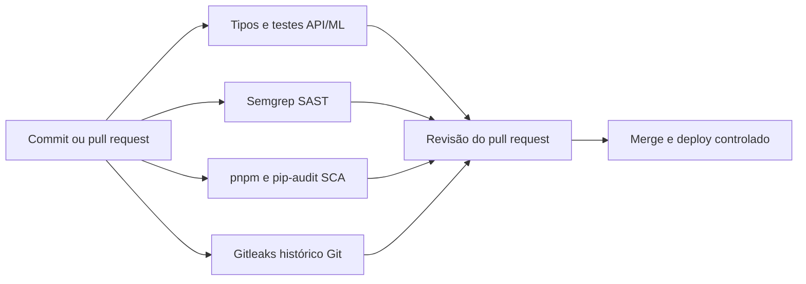

# Segurança do Faro AI

Este documento descreve os controles do Sprint 3 para a API Fastify, o app Expo,
o site Next.js, o serviço ML FastAPI e o banco PostgreSQL. O escopo não inclui IoT,
MQTT ou dispositivos conectados.

| Área do sprint | Peso | Estado neste repositório |
|---|---:|---|
| DevSecOps e pipeline | 3,0 | Workflow de CI, análise estática, auditoria de dependências e secret scan configurados |
| Segurança de código e infraestrutura | 2,5 | Validação, RBAC, escopo por concessionária na API, gestão de segredos e controles de rede no código |
| Monitoramento e resposta a incidentes | 2,0 | Logs estruturados e trilha de auditoria; alertas e centralização dependem do deploy |
| Compliance e segurança contínua | 2,5 | Minimização e controles de acesso; retenção, avaliação legal e operação contínua pendentes |

Um controle marcado como configurado existe no código ou no workflow. Isso não
significa que a execução do CI ou a configuração de produção já foi verificada.

## DevSecOps e pipeline

Os testes detectam regressões de autorização e validação. O Semgrep procura
padrões inseguros no código. As auditorias de dependências identificam pacotes
com avisos conhecidos; o Gitleaks detecta segredos versionados. O job de SCA
publica os relatórios como artefatos e não bloqueia o merge enquanto houver
avisos conhecidos. Esta é uma dívida aberta, não uma aprovação de segurança.
Em 27/09/2026, antes da atualização do Next.js, `pnpm audit --prod` encontrou
173 avisos, incluindo 6 críticos. Depois da atualização para Next.js 15.5.26,
restaram 137 avisos, incluindo 2 críticos em `tar` e `shell-quote` trazidos pela
cadeia de ferramentas Expo. Revise os relatórios atuais em cada PR e corrija
essas dependências sem quebrar o build mobile. O deploy ainda não é automatizado.

O workflow `.github/workflows/ci.yml` roda em pull requests e pushes para `main`.
Ele verifica tipos no API, no site e no app mobile. O job ML treina o modelo e
roda os testes que já faziam parte do workflow.

O pipeline também configura estes controles:

- **SAST:** Semgrep analisa API, site, app e serviço ML.
- **SCA:** `pnpm audit` e `pip-audit` verificam dependências vulneráveis.
- **Secret scanning:** Gitleaks analisa o histórico completo do Git.
- **Atualizações:** Dependabot abre pull requests semanais para pacotes e GitHub Actions.
- **Instalação reproduzível:** CI instala JavaScript com `pnpm install --frozen-lockfile`.

Configure proteção de branch no GitHub para exigir os jobs antes do merge. O
workflow, sozinho, não bloqueia merges pelas configurações do repositório.

## Segurança de código e infraestrutura

### Entrada, acesso e banco

- As rotas Fastify validam parâmetros, consultas e corpos com Zod.
- O plugin de autenticação valida localmente os JWTs emitidos pela própria API
  (`POST /auth/login`, HS256). O login confere a senha contra o hash bcrypt
  (custo 12) de `profiles.password_hash` e gasta o mesmo tempo quando o e-mail
  não existe, para não revelar quais e-mails estão cadastrados. Não há rota de
  cadastro: usuários são criados por script (`pnpm db:user`).
- `authorize` limita operações de escrita do catálogo a `gestor` e `admin`.
  Configuração de chaves de IA exige `admin`.
- Nenhuma rota da API altera `role` ou `dealership_id` de um perfil: essas
  mudanças são feitas por um administrador (`pnpm db:user` ou SQL direto), e o
  token só reflete a mudança no próximo login.
- O banco é PostgreSQL padrão, sem RLS: a API é a **única** porta de acesso e
  aplica o escopo de concessionária explicitamente em cada consulta
  (`lib/data-access.ts`: `readScopeOf`, `writeScopeOf`, `scopeFilter`,
  `assertCanModify`). Esse módulo concentra a regra e os testes a cobrem; uma
  rota nova que esquecer o filtro enxerga todas as lojas, por isso a revisão de
  PR deve conferir o escopo de toda consulta nova.
- Todas as consultas são parametrizadas (`postgres.js`); `sql.unsafe` só é usado
  pelo executor de migrations. As funções SQL de leads e métricas usam
  `SECURITY INVOKER`, limitam resultados e só são chamadas por rotas de
  gestor/admin (escopo de leitura da rede inteira).
- A conexão do banco (`DATABASE_URL`) fica só no backend. Em produção use um
  usuário de banco com privilégios mínimos (sem superusuário) e exija TLS na
  conexão (`sslmode=require`).
- Chaves de provedores configuradas pela tela admin ficam na tabela `ai_keys`;
  o app retorna apenas se estão configuradas, sem mostrar fragmentos. Antes de
  produção, mova esses valores para um secret manager e defina rotação.

### Rede, serviços e conteúdo remoto

- Fastify usa uma lista explícita de origens CORS, Helmet e limite de requisições
  por IP. `TRUST_PROXY` fica `false` por padrão.
- A API e o serviço ML não expõem Swagger em produção. O serviço ML não aceita
  CORS de qualquer origem.
- O ML exige bearer token com pelo menos 32 caracteres. O gateway assina o corpo
  de `/predict` com HMAC, timestamp e nonce. O serviço rejeita assinaturas
  vencidas e nonces repetidos.
- O cache de nonces do ML fica na memória do processo. Uma implantação com mais
  de um worker precisa de um armazenamento compartilhado para manter essa
  proteção entre workers.
- URLs de e-books aceitam apenas HTTPS nos domínios oficiais de fabricantes. O
  downloader valida cada redirecionamento e interrompe downloads acima de 30 MB.

O repositório não configura o proxy de produção, DNS, certificado TLS, firewall,
rede privada para ML, gestão de segredos ou backup do PostgreSQL. Em produção, termine
TLS em um proxy confiável e restrinja o acesso de rede ao ML. Defina
`TRUST_PROXY=true` somente quando a API aceitar tráfego por esse proxy.

### Dados e privacidade

- Novos CPFs são transformados em HMAC-SHA256 com `CLIENT_CPF_PEPPER`. Gere o
  segredo com `openssl rand -hex 32` e mantenha-o estável. O sistema não guarda
  o CPF original para recalcular hashes antigos.
- O app nativo armazena a sessão com `expo-secure-store`. O app web guarda o
  token da API no armazenamento do navegador (`localStorage`, chave
  `faroai.session`); esse token expira junto com o JWT.
- Logs HTTP não incluem query strings. O logger redige cabeçalhos de autorização
  e cookies. O plugin de auth não grava JWTs nem hashes de senha.
- O ML recebe atributos de compra e perfil, como idade, renda, score de crédito
  e modelo. O identificador da concessionária é pseudonimizado. Esses atributos
  continuam sendo dados pessoais; pseudonimização não é anonimização.
- A classificação híbrida e os insights podem enviar atributos financeiros e
  demográficos a um provedor de IA. Notas e histórico de ações também podem ser
  enviados à classificação híbrida. Essa rota remove padrões comuns de CPF,
  e-mail, telefone e VIN, mas não detecta todos os identificadores indiretos.

Antes de usar dados reais em produção, aprove os provedores de IA, a base legal,
os termos de tratamento, a transferência internacional e os prazos de retenção.
O repositório não implementa um calendário de retenção nem comprova exclusão
automática de dados.

## Monitoramento e resposta a incidentes

Fastify grava logs estruturados com Pino. Erros de autenticação, falhas do banco,
erros 5xx e falhas de gravação de auditoria aparecem no log. A API limita
requisições e retorna erros sem stack trace.

A tabela `audit_log` registra criação e alteração de clientes, ações de retenção,
envio de e-mail, alterações no catálogo, mudanças de configuração de IA e logins
(`auth.login` e `auth.login_failed`). Só o backend grava eventos. A gravação é
best-effort: uma falha aparece no Pino e não interrompe a operação. Nenhuma rota
lê a tabela; a leitura exige acesso direto ao banco.

Este repositório não inclui um agregador de logs, alertas, painel de segurança,
plantão ou automação de resposta. Para um incidente, a equipe precisa conter o
serviço afetado, revogar e substituir as credenciais expostas, revisar os eventos
de auditoria e preservar os logs. O responsável por privacidade deve avaliar se
há obrigação de notificar a ANPD ou as pessoas afetadas.

| Componente | Sinal a acompanhar | Alerta proposto |
|---|---|---|
| API | Taxa de 5xx, 401/403, 429 e latência por rota | 5xx acima de 2% por 5 min; aumento súbito de 401/429 |
| Mobile/web | Falhas de login, erros de rede e crashes | Aumento sustentado após uma release |
| PostgreSQL | Falhas de consulta, conexões e alterações de perfis | Falha de banco ou mudança de role fora do fluxo aprovado |
| ML | 5xx, latência de `/predict`, rejeições HMAC e nonces repetidos | Rejeições repetidas ou indisponibilidade por 5 min |
| IoT | Não aplicável: a solução não contém dispositivo, broker ou telemetria MQTT | Não aplicável |

Um painel pode usar logs Pino, eventos de `audit_log` e métricas do provedor de
deploy. Ainda não há dashboard configurado nem capturas de tela para anexar;
esses itens exigem ambiente operacional. Em um incidente, registre hora e
impacto, analise logs e trilha de auditoria, contenha o acesso, revogue segredos,
remova a causa, restaure de backup validado e monitore a recuperação.

## Compliance e segurança contínua

### Revisão STRIDE

| Ameaça | Evidência no projeto | Risco restante |
|---|---|---|
| Spoofing | JWT com assinatura/expiração; senha em bcrypt (custo 12) e login sem diferença de tempo entre e-mail inexistente e senha errada | Revogação de tokens próprios só ocorre na expiração |
| Tampering | Zod, autorização por perfil, SQL parametrizado e HMAC API→ML | O escopo por loja depende de cada consulta aplicá-lo (sem RLS como segunda camada) |
| Repudiation | `audit_log` para mudanças críticas e Pino para falhas | Auditoria é best-effort; falta retenção centralizada |
| Information disclosure | Redação de tokens em logs, CPF em HMAC, escopo por loja | Dados pessoais ainda podem chegar a provedores de IA |
| Denial of service | Rate limit e limites de payload/consulta | Sem proteção de borda nem alertas implantados |
| Elevation of privilege | Papéis `analista`, `gestor`, `admin` e bloqueio de edição de perfil | Exige teste periódico de cada rota nova |

O mapeamento se apoia nos controles implementados e não substitui uma avaliação
de ameaças no ambiente implantado.

O escopo de dados inclui identificadores de cliente, dados de compra,
características demográficas e financeiras, notas de vendedores, previsões e
ações de retenção. O cliente e seus dados ficam vinculados à concessionária pelas
verificações de escopo da API.

Use os seguintes controles como referência para revisão:

- [OWASP ASVS](https://owasp.org/www-project-application-security-verification-standard/) para controles da API e do site.
- [OWASP API Security Top 10](https://owasp.org/API-Security/) para autorização por objeto, autenticação e consumo de recursos.
- [OWASP Mobile Application Security](https://owasp.org/www-project-mobile-app-security/) para armazenamento local e sessão no app.
- [Lei Geral de Proteção de Dados](https://www.planalto.gov.br/ccivil_03/_ato2015-2018/2018/lei/l13709.htm) para finalidade, necessidade, direitos e resposta a incidentes.

Revise os achados do SAST e do SCA em cada pull request. Atualize dependências
vulneráveis, revise a trilha de auditoria e reavalie o fluxo de dados quando
adicionar um provedor, campo pessoal ou integração.

### Pendências antes de produção

- Exigir os jobs de CI nas regras de proteção da branch `main`.
- Usar um usuário de banco sem privilégios de superusuário e conexão com TLS.
- Configurar TLS, proxy confiável, firewall e rede privada para o serviço ML.
- Guardar segredos em um secret manager e definir a rotação de cada segredo.
- Definir retenção, descarte, restauração de backup e responsáveis por incidentes.
- Aprovar contratos e fluxos de dados dos provedores de IA.
- Verificar alertas operacionais e executar um exercício de resposta a incidentes.
