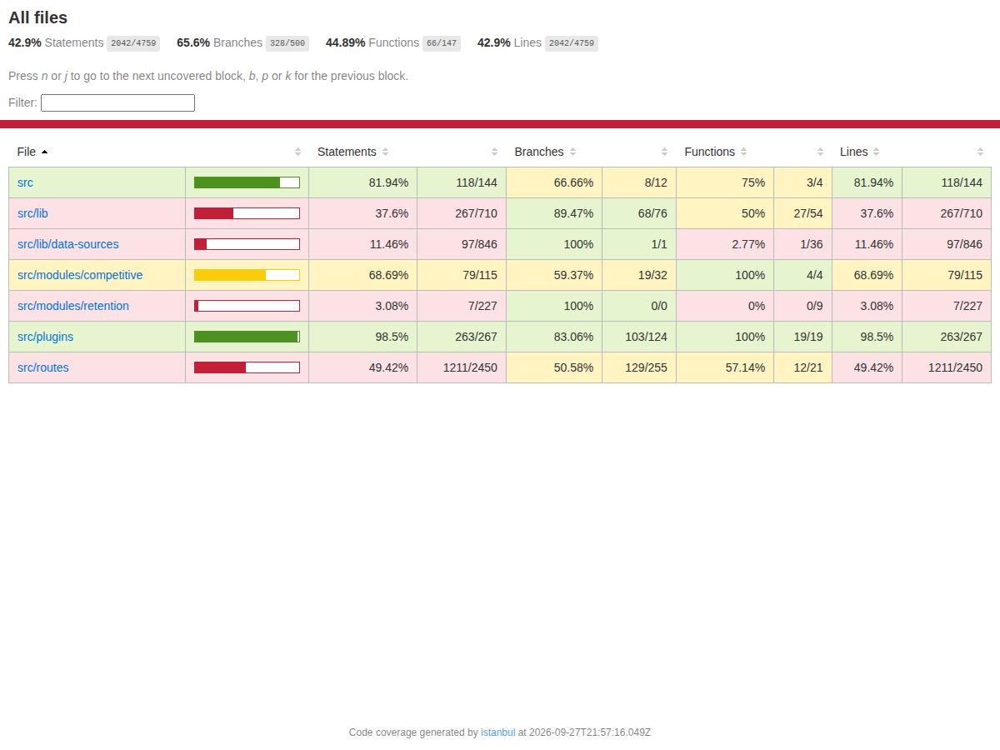

# Evidências — Testes automatizados da API

> Sprint 3 · critério **Testes Automatizados (15%)**. Resultado gerado a partir de `apps/api/test-results/junit.xml`.

## Resultado

| Testes | Passaram | Falhas | Tempo |
|---|---|---|---|
| **110** | **110** ✅ | 0 | 45,8 s |

Executada 3 vezes seguidas (duas sem cobertura e uma com), sempre 110/110 — sem testes instáveis.

## Como reproduzir

Os testes sobem a API em memória sobre um **PostgreSQL real de teste** (banco `faroai_test`) e simulam apenas FIPE, IA e rede — não precisam de chaves nem de internet. Não há banco simulado: o login confere a senha (bcrypt) em `public.profiles`, e cada rota grava e lê de verdade.

```bash
createdb faroai_test                       # uma vez (ou um container postgres:16)
pnpm install                               # uma vez, na raiz do repositório
pnpm --filter @ford/api test              # roda os testes (aplica as migrations pendentes sozinho)
pnpm --filter @ford/api test:coverage     # + cobertura
```

- **Qual banco:** `TEST_DATABASE_URL`; senão a `DATABASE_URL` do ambiente, desde que o banco termine em `_test` (é o caso do CI); senão `postgres://postgres@127.0.0.1:5432/faroai_test`. Qualquer banco que **não** termine em `_test` é recusado — a suíte apaga dados.
- **Antes da suíte** (`test/global-setup.ts`): confere o banco e aplica as migrations de `db/migrations` pendentes, com o mesmo runner do projeto (`scripts/db-migrate.mjs`).
- **Antes de cada teste** (`test/helpers/db.ts`): apaga os dados, recria duas concessionárias (A e B) e 9 usuários com senha bcrypt (analista, gestor e admin × loja A, loja B e sem loja). Os tokens vêm de `POST /auth/login`.
- Os arquivos rodam em série (`fileParallelism: false`) porque compartilham o mesmo banco.

Relatórios gerados em `apps/api/test-results/`: `junit.xml` (resultado de cada teste) e `coverage/index.html` (cobertura navegável). No GitHub Actions, o job `quality` sobe um `postgres:16`, roda os testes e publica esses relatórios como artefato `api-test-results`.

## O que é testado

| Arquivo | Testes | Cobre |
|---|---|---|
| `apps/api/test/jwt.test.ts` | 13 | Geração com claims · expiração · adulteração · outro segredo, emissor ou audiência · `alg: none` · perfil inválido |
| `apps/api/test/auth.test.ts` | 20 | Login 200/400/401/429/502 · bcrypt contra `profiles.password_hash` · e-mail inexistente e usuário sem senha com a mesma resposta (e tempo semelhante) · e-mail normalizado · auditoria · 401 sem token, expirado, adulterado ou de outro emissor |
| `apps/api/test/authorization.test.ts` | 32 | Só 2 rotas públicas · **todas** as rotas protegidas respondem 401 sem token · matriz de perfis (403) · escopo de concessionária do analista em clientes, ações, métricas, e-mail e reclassificação (404/403) |
| `apps/api/test/errors.test.ts` | 8 | 400 com lista de campos · JSON malformado · 401 · 403 · 404 · 500 sem vazar detalhes do banco (falha real do Postgres) |
| `apps/api/test/clients-acoes.test.ts` | 14 | 201 · CPF só como hash · 409 VIN duplicado (violação real de unicidade) · 403 sem concessionária · 404 · 422 · KPIs e campanha por loja |
| `apps/api/test/vehicles.test.ts` | 18 | Listagem · lookup com campos dinâmicos · comparação com vencedor · 400/404/415/422 · 502 FIPE · 503 catálogo · 500 sem vazar detalhes (gatilho real no banco) |
| `apps/api/test/openapi.test.ts` | 5 | Bearer JWT e ProblemDetails publicados · 401/403 e perfis documentados em toda rota · erros em application/problem+json |

### Cenários exigidos pela rubrica

| Cenário | Exemplos de testes |
|---|---|
| **Sucesso** | login devolve JWT · `/me` com as claims · criar cliente (201) · comparar veículos · campanha (201) · atualizar preço FIPE |
| **Erro** | 400 validação · 404 inexistente · 409 VIN duplicado · 415 arquivo · 422 · 429 força bruta · 500/502/503 sem vazar detalhes |
| **Acesso não autorizado** | 401 sem token / expirado / adulterado / outro segredo ou emissor · 403 perfil sem permissão · 404/403 fora da concessionária |
| **Identidade local** | senha correta 200 · senha errada 401 `invalid_credentials` · e-mail inexistente 401 com a mesma resposta e tempo semelhante · usuário sem `password_hash` 401 |

## Cobertura dos módulos da Sprint 3

| Módulo | Responsabilidade | Linhas cobertas |
|---|---|---|
| `apps/api/src/lib/jwt.ts` | geração e validação do JWT | 100% |
| `apps/api/src/plugins/auth.ts` | autenticação e `authorize(perfis)` | 96,66% |
| `apps/api/src/lib/identity.ts` | login local (bcrypt em `profiles`) | 100% |
| `apps/api/src/lib/data-access.ts` | escopo por concessionária | 94,28% |
| `apps/api/src/plugins/error-handler.ts` | Problem Details | 100% |
| `apps/api/src/lib/api-error.ts` | erros HTTP tipados | 100% |
| `apps/api/src/plugins/openapi.ts` | documentação de acesso e erros | 100% |
| `apps/api/src/routes/auth.ts` | `POST /auth/login` | 100% |

Cobertura total da API: 46,7% das linhas — o total inclui integrações de IA, scrapers e ML, fora do escopo desta sprint.

> A imagem `cobertura.png` abaixo é de uma execução anterior; o relatório navegável atual está em `apps/api/test-results/coverage/index.html`.



## Lista completa de testes

### JWT — geração e validação — `jwt.test.ts`

- ✅ JWT — geração > gera token HS256 com as claims registradas e as de autorização
- ✅ JWT — geração > gera um jti diferente a cada emissão
- ✅ JWT — validação > aceita token válido e devolve os dados do usuário
- ✅ JWT — validação > rejeita token expirado com token_expired
- ✅ JWT — validação > rejeita token com payload adulterado (analista → admin)
- ✅ JWT — validação > rejeita token assinado com outro segredo
- ✅ JWT — validação > rejeita token de outro emissor (iss)
- ✅ JWT — validação > rejeita token para outra audiência (aud)
- ✅ JWT — validação > rejeita token sem assinatura (alg: none)
- ✅ JWT — validação > rejeita token bem assinado mas com perfil desconhecido
- ✅ JWT — validação > rejeita texto que não é JWT
- ✅ JWT — identificação do emissor > reconhece tokens emitidos por esta API
- ✅ JWT — identificação do emissor > não reconhece tokens de outro emissor nem texto inválido

### Autenticação — login e uso do token — `auth.test.ts`

- ✅ POST /auth/login > 200 — devolve JWT Bearer com validade
- ✅ POST /auth/login > o token emitido dá acesso a /me com o perfil e a concessionária do usuário
- ✅ POST /auth/login > normaliza o e-mail (maiúsculas e espaços)
- ✅ POST /auth/login > usuário sem perfil cadastrado recebe o menor privilégio (analista)
- ✅ POST /auth/login > registra o login no audit_log
- ✅ POST /auth/login > 401 — senha errada, com mensagem genérica e WWW-Authenticate
- ✅ POST /auth/login > 401 — e-mail inexistente recebe a MESMA resposta (não revela quem existe)
- ✅ POST /auth/login > 401 — e-mail inexistente leva tempo semelhante ao de senha errada (sem vazar por timing)
- ✅ POST /auth/login > 401 — usuário sem password_hash não entra, com a mesma resposta genérica
- ✅ POST /auth/login > 401 — senha vazia ou só de espaços não substitui a senha cadastrada
- ✅ POST /auth/login > 400 — corpo inválido lista os campos com problema
- ✅ POST /auth/login > 502 — base de identidade fora do ar
- ✅ POST /auth/login > 429 — bloqueia força bruta após 10 tentativas por minuto do mesmo IP
- ✅ Uso do token nas rotas protegidas > 401 — requisição sem token
- ✅ Uso do token nas rotas protegidas > 401 — token expirado, com código específico
- ✅ Uso do token nas rotas protegidas > 401 — token com assinatura inválida
- ✅ Uso do token nas rotas protegidas > 401 — token com o perfil adulterado (analista → admin) não é aceito
- ✅ Uso do token nas rotas protegidas > 401 — esquema diferente de Bearer é ignorado
- ✅ Uso do token nas rotas protegidas > 401 — token de outro emissor (como o de um provedor externo) não é aceito
- ✅ Uso do token nas rotas protegidas > 401 — token desconhecido (texto que não é JWT)

### Autorização — público × protegido, perfis e escopo — `authorization.test.ts`

- ✅ Rotas públicas × protegidas > apenas /health e /auth/login são públicas
- ✅ Rotas públicas × protegidas > /health e a documentação abrem sem token
- ✅ Rotas públicas × protegidas > TODA rota protegida responde 401 sem token (segura por padrão)
- ✅ Rotas públicas × protegidas > 401 acontece ANTES da validação do corpo (payload não é processado)
- ✅ Matriz de perfis > GET /admin/ai-keys (corpo: undefined) como analista → 403
- ✅ Matriz de perfis > GET /admin/ai-keys (corpo: undefined) como gestor → 403
- ✅ Matriz de perfis > GET /admin/ai-keys (corpo: undefined) como admin → 200
- ✅ Matriz de perfis > DELETE /competitive/vehicles/00000000-0000-4000-8000-00000000000a (corpo: undefined) como analista → 403
- ✅ Matriz de perfis > DELETE /competitive/vehicles/00000000-0000-4000-8000-00000000000a (corpo: undefined) como gestor → 200
- ✅ Matriz de perfis > POST /acoes/campanha (corpo: {"perfil":"fiel","tipo":"email","titulo":"Campanha"}) como analista → 403
- ✅ Matriz de perfis > POST /acoes/campanha (corpo: {"perfil":"fiel","tipo":"email","titulo":"Campanha"}) como gestor → 200
- ✅ Matriz de perfis > GET /competitive/vehicles (corpo: undefined) como analista → 200
- ✅ Matriz de perfis > GET /admin/ai-function-models (corpo: undefined) como analista → 200
- ✅ Matriz de perfis > GET /clients/leads (corpo: undefined) como analista → 403
- ✅ Matriz de perfis > GET /clients/leads/stats (corpo: undefined) como analista → 403
- ✅ Matriz de perfis > GET /metrics/anomalias-dealer (corpo: undefined) como analista → 403
- ✅ Escopo de concessionária > analista lista apenas os clientes da própria concessionária
- ✅ Escopo de concessionária > gestor lista os clientes da rede inteira
- ✅ Escopo de concessionária > analista recebe 404 ao abrir cliente de outra loja (não revela que existe)
- ✅ Escopo de concessionária > gestor abre cliente de outra loja
- ✅ Escopo de concessionária > PATCH notas: 'analista' da loja A em cliente da 'loja B' → 404
- ✅ Escopo de concessionária > PATCH notas: 'gestor' da loja A em cliente da 'loja B' → 403
- ✅ Escopo de concessionária > PATCH notas: 'gestor' da loja A em cliente da 'loja A' → 200
- ✅ Escopo de concessionária > PATCH notas: 'admin' da loja A em cliente da 'loja B' → 200
- ✅ Escopo de concessionária > analista sem concessionária vinculada recebe 403 no_dealership
- ✅ Escopo do analista em ações, métricas e e-mail > GET /acoes — analista vê só as ações da própria loja; gestor vê a rede
- ✅ Escopo do analista em ações, métricas e e-mail > GET /acoes?client_id — analista não alcança as ações de cliente de outra loja
- ✅ Escopo do analista em ações, métricas e e-mail > PATCH /acoes/:id — gestor enxerga a ação de outra loja mas não altera (403)
- ✅ Escopo do analista em ações, métricas e e-mail > GET /metrics/dealership — analista conta só a própria loja; gestor, a rede
- ✅ Escopo do analista em ações, métricas e e-mail > GET /metrics/proximas-revisoes e /metrics/garantia-status — analista não vê clientes de outra loja
- ✅ Escopo do analista em ações, métricas e e-mail > POST /acoes/email-send — analista recebe 404 para cliente de outra loja; gestor, 403
- ✅ Escopo do analista em ações, métricas e e-mail > POST /clients/:id/reclassify — analista recebe 404 para cliente de outra loja

### Erros padronizados (Problem Details) — `errors.test.ts`

- ✅ Formato Problem Details > 400 — validação lista cada campo inválido
- ✅ Formato Problem Details > 400 — JSON malformado
- ✅ Formato Problem Details > 401 — traz WWW-Authenticate
- ✅ Formato Problem Details > 403 — perfil sem permissão
- ✅ Formato Problem Details > 404 — recurso inexistente
- ✅ Formato Problem Details > 404 — rota inexistente
- ✅ Formato Problem Details > instance não ecoa a query string (evita vazar parâmetros)
- ✅ Formato Problem Details > 500 — falha do banco não vaza mensagem, código nem hint do Postgres

### Desafio 2 — clientes e ações — `clients-acoes.test.ts`

- ✅ POST /clients > 201 — cria o cliente na concessionária do usuário
- ✅ POST /clients > não grava o CPF em texto puro — apenas o hash
- ✅ POST /clients > 409 — VIN já cadastrado
- ✅ POST /clients > 403 — usuário sem concessionária não pode cadastrar
- ✅ GET /clients/:id > 200 — devolve cliente, predições e histórico
- ✅ GET /clients/:id > 400 — id que não é UUID
- ✅ Ações de retenção > POST /acoes 201 — registra a ação na loja do usuário
- ✅ Ações de retenção > POST /acoes 404 — cliente inexistente
- ✅ Ações de retenção > POST /acoes 403 — gestor não registra ação para cliente de outra loja
- ✅ Ações de retenção > PATCH /acoes/:id 200 — concluir a ação registra completed_at
- ✅ Ações de retenção > PATCH /acoes/:id 404 — analista não enxerga ação de outra loja
- ✅ Ações de retenção > GET /acoes/kpis — analista só contabiliza a própria loja
- ✅ Ações de retenção > POST /acoes/email-send 422 — cliente sem e-mail cadastrado
- ✅ Ações de retenção > POST /acoes/campanha 201 — gestor cria uma ação para cada cliente do perfil

### Desafio 1 — catálogo competitivo — `vehicles.test.ts`

- ✅ Consulta e comparação > GET /competitive/vehicles 200 — lista o catálogo
- ✅ Consulta e comparação > GET /competitive/lookup 200 — devolve só os campos pedidos (null explícito se ausente)
- ✅ Consulta e comparação > GET /competitive/lookup 404 — nenhum veículo combina
- ✅ Consulta e comparação > GET /competitive/lookup ignora caminhos que tentam alterar protótipos
- ✅ Consulta e comparação > POST /competitive/compare 200 — indica o vencedor de cada critério
- ✅ Consulta e comparação > POST /competitive/compare 400 — menos de 2 ids
- ✅ Consulta e comparação > POST /competitive/compare 422 — ids válidos que não existem no catálogo
- ✅ Manutenção do catálogo (gestor/admin) > DELETE 200 → GET 404: o veículo é removido
- ✅ Manutenção do catálogo (gestor/admin) > DELETE 404 — veículo que já não existe
- ✅ Manutenção do catálogo (gestor/admin) > DELETE 500 — falha do banco sem vazar detalhes
- ✅ Manutenção do catálogo (gestor/admin) > POST /competitive/vehicles/import 200 — importa lista JSON
- ✅ Manutenção do catálogo (gestor/admin) > POST /competitive/vehicles/import 400 — JSON malformado
- ✅ Manutenção do catálogo (gestor/admin) > POST /competitive/vehicles/import 422 — nenhum item válido
- ✅ Manutenção do catálogo (gestor/admin) > POST /competitive/import/file 415 — tipo de arquivo não suportado
- ✅ Integrações externas > refresh-price 502 — FIPE fora do ar, sem vazar detalhes da falha
- ✅ Integrações externas > refresh-price 404 — combinação inexistente na FIPE
- ✅ Integrações externas > refresh-price 200 — atualiza o preço com o valor da FIPE
- ✅ Integrações externas > auto-fill 503 — catálogo canônico ainda não carregado

### Documentação OpenAPI — `openapi.test.ts`

- ✅ Swagger / OpenAPI > publica OpenAPI 3 com esquema Bearer JWT e o schema ProblemDetails
- ✅ Swagger / OpenAPI > toda rota protegida documenta 401 e informa o acesso na descrição
- ✅ Swagger / OpenAPI > rotas restritas por perfil documentam 403 e os perfis permitidos
- ✅ Swagger / OpenAPI > toda resposta de erro usa application/problem+json com o schema ProblemDetails
- ✅ Swagger / OpenAPI > cada entrada de ROUTE_ERRORS corresponde a uma rota real e aparece documentada
